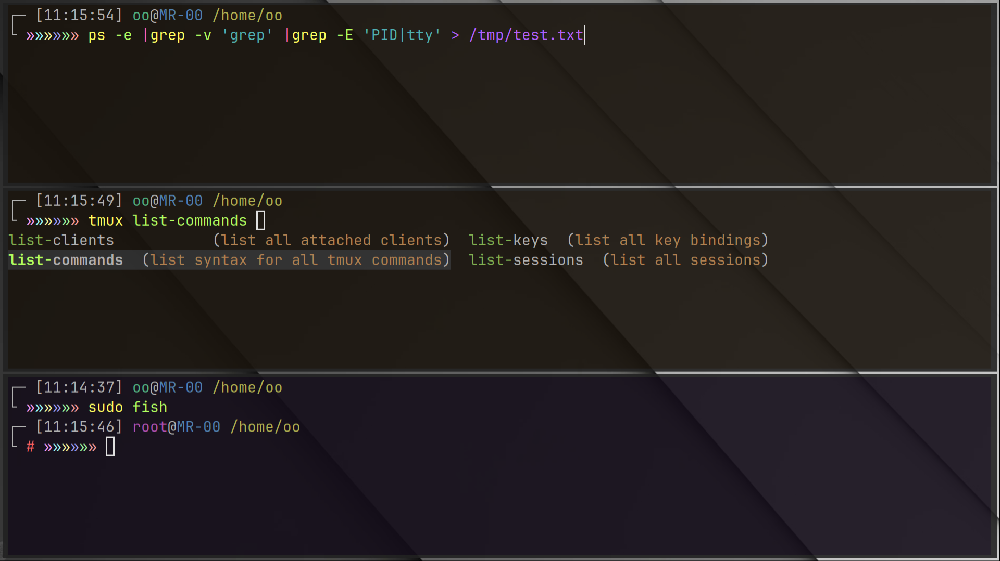

## Misty Colorful theme for fish  

迷幻多彩主题。  

-- Global Preview 全局预览  
  

----  

### Suggestion 建议  

Your app, Your rule. Feel free to modify the files.  

& some suggestions for settings outside the plugin.  
- Maybe a gray-textured wallpaper will be better fit this.  
- & set a little transparency in the terminal emulator, about 80%|90%.  

& some personal preference settings outside the plugin.  
- dark orange   `#1a140d` as the bg color for shell,    like `fish`.  

你的应用，你说了算。不要害怕修改文件。  

& 一些在插件之外的设定建议。  
- 也许一张灰色纹理的壁纸会更适配。  
- 且在终端模拟器中设置一点透明度，大约 80%|90%。  

& 一些在插件外部的个人喜好设定。  
- 深橙色(棕)`#1a140d` 作为命令解析器`fish`的背景色。  

----  

### Installation 安装  

**The path of the actual config file should be modified according to your own `fish`.**  

实际配置文件的路径应该根据你自己的 `fish` 进行修改。  

#### Manual(Recommended) 手动（推荐）  

Clone the repo to your fish config dir :  
```  
git clone https://github.com/ovwxxwvo/misty.fish.git ~/.config/fish/plugins/  
```  
Add this line to your fish config file :  
```  
source ~/.config/fish/plugins/misty.fish/init.fish  
```  

----  

### Configurations 配置  

You can create a file for configuration & source it :  
```  
mkdir ~/.config/fish/config  
touch ~/.config/fish/config/misty.fish  
vi    ~/.config/fish/config/misty.fish  
```  
Add this line to your fish config file for `source` :  
```  
source ~/.config/fish/config/misty.fish  
```  

Or you can just directly modify the config file in the plugin :  
```  
vi ~/.config/fish/plugins/misty.fish/color.fsh  
vi ~/.config/fish/plugins/misty.fish/style.fsh  
```  

#### Configurations Options 配置选项  

There are quite a lot of configuration options.  
Maybe you just pick the ones you need and modify them.  

有相当多的配置选项。也许你只挑选你需要的并进行修改。  

~/.config/fish/plugins/misty.fish/style.fsh  
```  
set  style_con_up  "┌─"  
set  style_con_dn  "└"  
set  style_prefix  "»"  
```  

~/.config/fish/plugins/misty.fish/color.fsh  
```  
# set prompt color up  
  set -g  color_time    "b0b0b0"  
  set -g  color_user    "5080b0"  
  set -g  color_host    "50b080"  
  set -g  color_at      "b0b0b0"  
  set -g  color_pwd     "b0b050"  
  set -g  color_pipe    "8050b0"  

# set prompt color dn  
  set -g  color_hash    "b05050"  
  set -g  color_con_up  "b0b0b0"  
  set -g  color_con_dn  "b0b0b0"  

# set color pallete  
  set -g  color_re      "ffa0a0"  
  set -g  color_gr      "a0ffa0"  
  set -g  color_bl      "a0a0ff"  
  set -g  color_ye      "ffffa0"  
  set -g  color_cy      "a0ffff"  
  set -g  color_ma      "ffa0ff"  
  set -g  color_or      "d0ffa0"  
  set -g  color_le      "d0ffa0"  
  set -g  color_sg      "a0ffd0"  
  set -g  color_sb      "a0d0ff"  
  set -g  color_vi      "d0a0ff"  
  set -g  color_pi      "ffa0d0"  

# set color input  
  set -g  fish_color_error                     "b0b050"  
  set -g  fish_color_autosuggestion            "505050"  
  set -g  fish_color_command                   "ffff60"  
  set -g  fish_color_param                     "b0ff60"  
  set -g  fish_color_quote                     "50b0b0"  
  set -g  fish_color_redirection               "b060ff"  
  set -g  fish_color_end                       "ff60b0"  
  set -g  fish_color_operator                  "ff60ff"  
  set -g  fish_color_comment                   "b0b0b0"  
  set -g  fish_color_escape                    "30d080"  
  set -g  fish_color_match                     "3080d0"  

  set -g  fish_pager_color_completion          "b0b0b0"  
  set -g  fish_pager_color_description         "d0a070"  
  set -g  fish_pager_color_prefix              "80b050"  
  set -g  fish_pager_color_selected_prefix     "b0ff60"  

  set -g  fish_pager_color_progress             \x2d\x2dbackground\x3dfff0e0  
  set -g  fish_pager_color_selected_background  \x2d\x2dbackground\x3d303030  
```  

----  

### [MIT](LICENSE) License 许可证  


